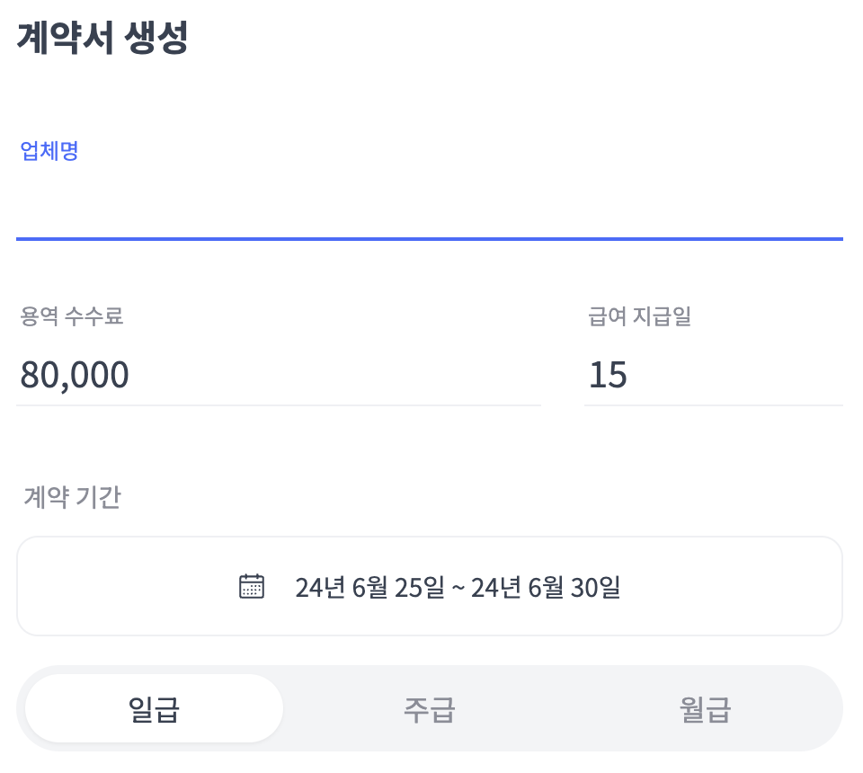
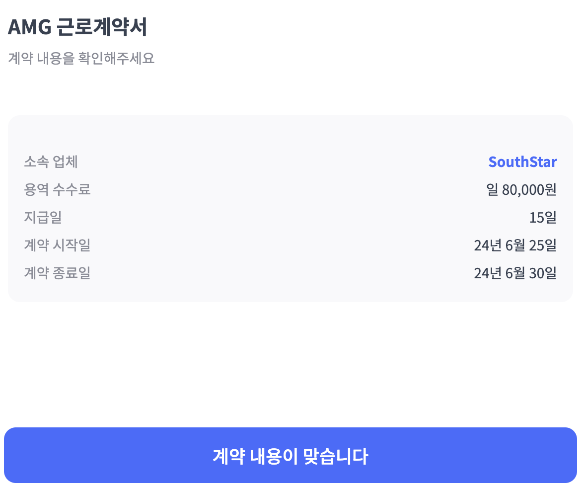

# AMG 근로계약서 모바일 작성

기존 아날로그 방식의 종이 계약서 작성을 모바일로 전환하여 데이터 수집을 편히하고 관리자 업무 시간을 단축합니다.

## 📃 개요

- **프로젝트명 :** Amg Write Contract
- **사용 기술 :** NextJS, TypeScript, Tailwind CSS
- **개발 :** 장성남 ( South Star )

## 📦 주요 기능

### 1. 계약서 생성 (관리자 페이지)

- 생성 된 계약서의 양식은 고유한 키 값을 배정받아, 데이터베이스에 저장됩니다.
- 해당 키 값의 링크를 생성합니다.

### 2. 계약서 작성 (사용자 페이지)

- DB에서 고유한 키값을 조회 후, 데이터를 받아와 계약서의 기본 값을 제공합니다.
- 사용자 입력 값을 관리자의 E-mail로 전송합니다.
